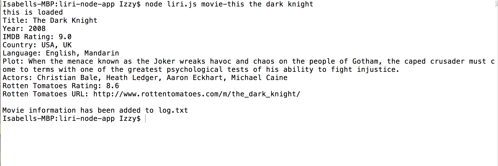

# liri-node-app

###This is a command line node app that takes in the following commands: 
	my-tweets
	spotify-this-song
	movie-this
	do-what-it-says

###Each command will display the information requested by the user.

###my-tweets will generate the 20 most current tweets from my personal Twitter account.

###spotify-this-song will display the Artist, Title, Album, and preview link from Spotify of a song title.

##movie-this will will display the Title, year of release, IMDB rating, country of origin, language, plot, actors, Rotten Tomatoes rating, and the Rotten Tomatoes url of the movie title.

###do-what-it-says will perform a default function.

###To use this app, simply clone the repository, npm install everything in the package.json, and open up your terminal/git bash.
	For my-tweets type into the terminal: node liri.js my-tweets
	For spotify-this-song type into the terminal: node liri.js spotify-this-song song title
	For movie-this type into the terminal: node liri.js movie-this movie title
	For do-what-it-says type into the terminal: node liri.js do-what-it-says

If you do not put in a song title or movie title for the spotify-this-song or movie-this command, the app will return a default entry.

###Below are images of the liri node app.

*This is the my-tweets command.

*This is the spotify-this-song command.

*This is the movie-this command.

*This is the do-what-it-says command.
